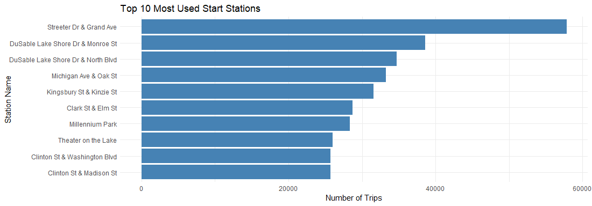

```{r setup, include=FALSE}
knitr::opts_chunk$set(echo = TRUE)
```

---
title: "Bike Sharing Case Study 2024"
author: "Yasin Karadag"
date: "`r Sys.Date()`"
output: 
  html_document:
    
---

## Data Preparation

### 1. Downloading Data Files

The dataset includes 12 `.csv` files, one for each month.  
You can download the monthly trip data from the following link:

👉 [Divvy Trip Data](https://divvy-tripdata.s3.amazonaws.com/index.html)

### 2. Merging Data Files into One File Using Postgres

All monthly files were imported into PostgreSQL as individual tables:

- `trip_data202401` to `trip_data202412`

These were combined into one single table with PostSQL.

```{sql Combine_Data_Files, eval=FALSE, include=TRUE}
CREATE TABLE trip_data_combined AS
SELECT * FROM trip_data202401
UNION ALL
SELECT * FROM trip_data202402
UNION ALL
SELECT * FROM trip_data202403
UNION ALL
SELECT * FROM trip_data202404
UNION ALL
SELECT * FROM trip_data202405
UNION ALL
SELECT * FROM trip_data202406
UNION ALL
SELECT * FROM trip_data202407
UNION ALL
SELECT * FROM trip_data202408
UNION ALL
SELECT * FROM trip_data202409
UNION ALL
SELECT * FROM trip_data202410
UNION ALL
SELECT * FROM trip_data202411
UNION ALL
SELECT * FROM trip_data202412
```


### 3. Creating ride_duration Column

```{sql Add_new_Column, eval=FALSE, include=TRUE}
ALTER TABLE trip_data_combined
ADD COLUMN ride_duration INTERVAL;
```
### 4. Calculating and Updating ride_duration

```{sql calculate_and_update, eval=FALSE, include=TRUE}
UPDATE trip_data_combined
SET ride_duration = ended_at - started_at;


```
### 5. Adding ride_duration_seconds Column

```{sql add_ride_duration_sec, eval=FALSE, include=TRUE}
ALTER TABLE trip_data_combined
ADD COLUMN ride_duration_seconds INT;


```
### 6. Calculating and Updating ride_duration_seconds Column
```{sql Calculate_Update, eval=FALSE, include=TRUE}
UPDATE trip_data_combined
SET ride_duration_seconds = EXTRACT(EPOCH FROM ride_duration);


```
## Data Cleaning
Below are the key steps performed to clean the data set before analysis:

### 1.Check for Missing Values in `member_casual` Column 
  - Verified that there are no missing (`NA`) values in the `member_casual` column.

```{r check-missing-member-casual, eval=FALSE, include=TRUE}
sum(is.na(df$member_casual))
```

### 2.Remove Entries with Zero or Negative Ride Duration
  - Identified 917 entries where ride_duration was zero or negative.
  - These rows were removed from the dataset.
```{r eval=FALSE, include=FALSE}
df <- df %>%
  filter(ride_duration_seconds > 0)
```
### 3.Remove Rides Longer Than 24 Hours
- Filtered out entries where ride_duration_seconds > 86400 seconds (24 hours).
```{r eval=FALSE, include=TRUE}
df <- df %>%
  filter(ride_duration_seconds <= 86400)

```
### 4.Remove Duplicate Entries (Same ride_id)
- Found and removed duplicate entries based on the ride_id column.
```{r eval=FALSE, include=TRUE}
df <- df %>%
  distinct(ride_id, .keep_all = TRUE)

```
### 5.Remove missing (`NA`) values in started_at column

```{r eval=FALSE, include=TRUE}
df <- df %>% filter(!is.na(started_at))

```


## Analyze

### Analysis of Average Ride Duration by User Type


```{r, echo=FALSE}
knitr::include_graphics("Pivot_Plot01.png")
```

From the bar chart above, we observe:

- Casual riders have an average ride duration of around 1200 seconds (20 minutes).

- Members tend to have shorter rides, averaging around 700 seconds (11-12 minutes).

- This difference may be due to factors such as casual riders using bikes for leisure, while members may use them for daily commuting.

I generate the bar chart using the `ggplot2` package.

```{r Pivot01, eval=FALSE, include=TRUE}
library(dplyr)
library(gt)

pivot_table <- df %>%
  group_by(member_casual) %>%
  summarise(avg_ride_duration = mean(ride_duration_sec, na.rm = TRUE)) 
pivot_table %>%
  gt() %>%
  tab_header(
    title = "Average Ride Duration by User Type"
  ) %>%
  cols_label(
    member_casual = "User Type",
    avg_ride_duration = "Average Ride Duration (sec)"
  ) %>%
  fmt_number(
    columns = c(avg_ride_duration),
    decimals = 2
  )

# Visualize the Data

library(ggplot2)

ggplot(pivot_table, aes(x = member_casual, y = avg_ride_duration, fill = member_casual)) +
  geom_bar(stat = "identity") +
  theme_minimal() +
  labs(title = "Average Ride Duration: Members vs Casual Riders",
       x = "User Type",
       y = "Average Ride Duration (seconds)") +
  scale_fill_discrete(name = "User Type")


```

```{r, echo=FALSE}
knitr::include_graphics("Pivot_Plot02.png")
```

The above plot reveals key trends in ride duration across different user types:


- Casual riders have an average ride duration of approximately 1200 seconds, indicating longer, possibly leisure-based rides.

- Members, on the other hand, show an average ride duration around 700 seconds, suggesting shorter, more utilitarian trips (likely daily commuting).

- The difference in ride duration implies a contrast in how each user type engages with the bike-sharing service.


```{r Pivot02, eval=FALSE, include=TRUE}
# Calculate average ride duration by member type and weekday
pivot_data <- df %>%
  group_by(member_casual, day_of_week) %>%
  summarise(avg_ride_length = mean(ride_duration_sec, na.rm = TRUE)) %>%
  ungroup()

# Visualize
ggplot(pivot_data, aes(x = day_of_week, y = avg_ride_length, fill = member_casual)) +
  geom_col(position = "dodge") +
  geom_text(
    aes(label = round(avg_ride_length, 1)),
    position = position_dodge(width = 0.9),
    vjust = -0.3,
    size = 3
  ) +
  scale_fill_manual(values = c("member" = "#1f77b4", "casual" = "#ff7f0e")) +
  labs(
    title = "Average Ride Duration by User Type and Day of Week",
    x = "Day of Week",
    y = "Avg. Ride Duration (seconds)",
    fill = "User Type"
  ) +
  theme_minimal(base_size = 13) +
  theme(
    plot.title = element_text(face = "bold", hjust = 0.5),
    legend.position = "top"
  )


```
## Analysis of Rides by User Type and Day of the Week

```{r, echo=FALSE}
knitr::include_graphics("Pivot_Plot03.png")
```

The bar chart illustrates the number of rides taken by casual riders and members across different days of the week.

### Key Observations:
- Weekdays (Monday to Friday):

  - Members consistently have a higher number of rides compared to casual users.

  - This trend suggests that members primarily use the service for daily commuting or regular trips.

- Weekends (Saturday and Sunday):

  - The number of rides taken by casual users increases significantly, closing the gap between the two user groups.

  - This indicates that casual riders tend to use bikes more for leisure and recreational activities on weekends.


```{r Pivot03, eval=FALSE, include=TRUE}
# 1. Create the Pivot Table (Count of rides)
pivot_data_count <- df %>%
  group_by(member_casual, day_of_week) %>%
  summarise(ride_count = n()) %>%
  ungroup()
#  2. Visualize the Pivot Table (Bar Chart)
ggplot(pivot_data_count, aes(x = day_of_week, y = ride_count, fill = member_casual)) +
  geom_col(position = "dodge") +
  labs(
    title = "Number of Rides by User Type and Day of Week",
    x = "Day of Week",
    y = "Number of Rides",
    fill = "User Type"
  ) +
  scale_fill_manual(values = c("member" = "#1f77b4", "casual" = "#ff7f0e")) +
  theme_minimal(base_size = 13) +
  theme(
    plot.title = element_text(face = "bold", hjust = 0.5),
    legend.position = "top"
  )
```
### Top 10 Most Used Start Stations


```{r, echo=FALSE}

```


```{r, echo=FALSE}

```

```{r TOP 10 Stations, eval=FALSE, include=TRUE}
# TOP 10 Stations

library(leaflet)
library(dplyr)
library(ggplot2)

## Code for bar plot
top_stations_geo <- df %>%
  filter(!is.na(start_station_name), !is.na(start_lat), !is.na(start_lng)) %>%
  group_by(start_station_name, start_lat, start_lng) %>%
  summarise(trip_count = n(), .groups = "drop") %>%
  arrange(desc(trip_count)) %>%
  slice_head(n = 10)
  
## Code for geoplot
ggplot(top_stations_geo , aes(x = reorder(start_station_name, trip_count), y = trip_count)) +
  geom_col(fill = "steelblue") +       
  coord_flip() +                       
  labs(
    title = "Top 10 Most Used Start Stations",
    x = "Station Name",
    y = "Number of Trips"
  ) +
  theme_minimal()                      


leaflet(top_stations_geo) %>%
  addTiles() %>%
  addCircleMarkers(
    lng = ~start_lng,
    lat = ~start_lat,
    label = ~paste0(start_station_name, ": ", trip_count, " rides"),
    radius = ~sqrt(trip_count) / 0,  
    color = "blue",
    fillOpacity = 0.7
  ) %>%
  addLegend("bottomright", colors = "blue", labels = "Start Stations", title = "Legend")

```


### Conclusion
Understanding these ride duration trends can help bike-sharing services optimize pricing, bike availability, and service offerings. Further analyses could explore seasonal trends or geographic variations to enhance user experience.
