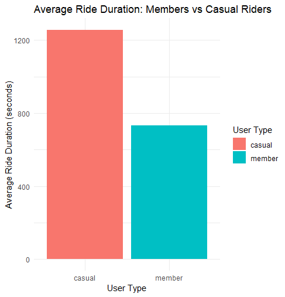
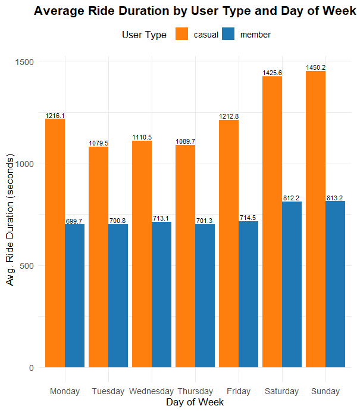
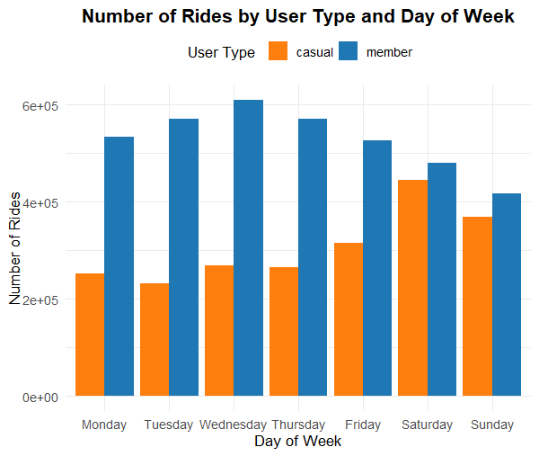
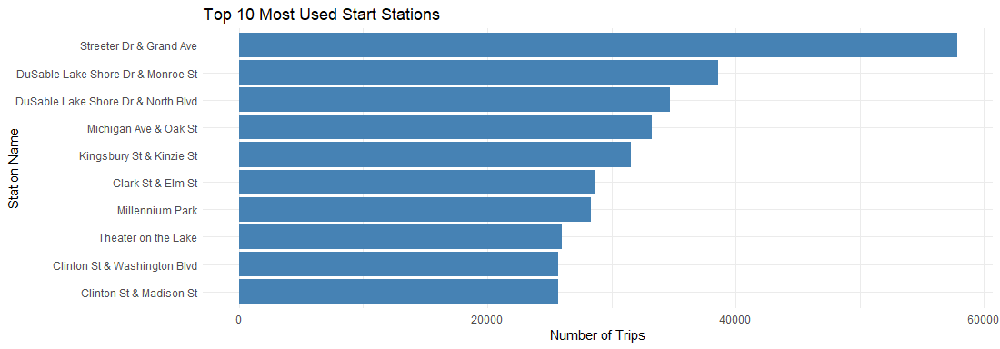

# Bike-Sharing-Case-Study-2024
A data analysis project using R to explore one year of Cyclistic bike-share data, highlighting differences between casual riders and members to support business decisions.
# 🚲 Cyclistic Bike-Share Case Study

This project explores one year of bike-sharing data from **Cyclistic**, a fictional bike-share company based in Chicago. The main objective is to analyze differences between **casual riders** and **annual members** and develop strategies to increase membership conversion.

## 📁 Project Files

- `Cyclistic Bike-Share Case Study_V2.Rmd`: Main RMarkdown analysis script
- `Cyclistic-Bike-Share-Case-Study_V2.html`: Analysis report generated in HTML format
- `Pivot_Plot01.png`: Visualization of average ride duration by user type
- `Pivot_Plot02.png`: Comparison of average ride duration by user type and day of the week.
- `Pivot_Plot03.png`: Visualization of number of rides by user type and day of the week
- `Top10_01.png`:  Bar chart comparing the top 10 most used start stations.
- `Top10_02.png`: Map visualization of locations of the top 10 most used start stations.
- `CaseStudy2024.Rproj`: RStudio project setup file

## 📊 Key Insights

- Casual users ride significantly longer on weekends compared to members.
- Members have more consistent riding habits throughout the week.
- The difference in usage patterns indicates that casuals use bikes mostly for leisure, while members use them for commuting.
  

## 🧹 Data Cleaning Highlights

- Removed negative and zero-duration trips
- Excluded rides longer than 24 hours (likely data errors)
- Converted and standardized date/time formats
- Calculated ride durations in both seconds and minutes
- Created new variables for day of week and user type groupings

## 📦 Tools & Libraries

- **PostSQL** for combining individual tables into one single table and managing columns 
- **R** (tidyverse: `dplyr`, `ggplot2`, `lubridate`, `readr`)
- **RMarkdown** for report generation
- Dataset: Provided by [Divvy Bikes - Chicago](https://divvybikes.com/system-data)

## 📌 Author

**Yasin Karadag**  
📧 yasinkaradag@gmail.com 
📍 Based in Austria | Background in Physics & Data Analytics  

---

